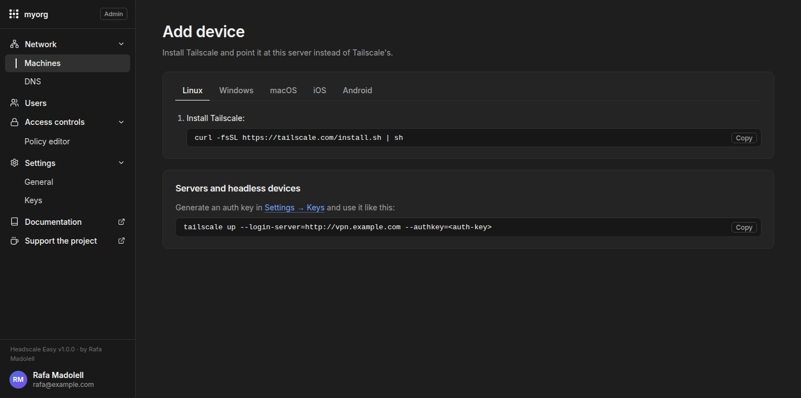

<p align="center">
  
</p>

<h1 align="center">Headscale Easy</h1>

<p align="center">
  <b>Headscale, with everything around it.</b><br>
  A deployment and management layer for <a href="https://github.com/juanfont/headscale">Headscale</a>, the open source Tailscale control server:
  installer, HTTPS, accounts and sign-in, a Tailscale-style web console and backups. One command to install.
</p>

<p align="center">
  <a href="https://github.com/insanerask77/headscale-easy/actions/workflows/ci.yml"></a>
  <a href="https://github.com/insanerask77/headscale-easy/releases"></a>
  <a href="https://github.com/insanerask77/headscale-easy/pkgs/container/headscale-easy"></a>
  <a href="https://insanerask77.github.io/headscale-easy/"></a>
  <a href="LICENSE"></a>
  <a href="https://github.com/insanerask77/headscale-easy/stargazers"></a>
  <a href="https://ko-fi.com/rafaelmadolell"></a>
</p>

<p align="center">
  <b>English</b> · <a href="README.es.md">Español</a>
</p>

> [!WARNING]
> **Security notice.** This is security-sensitive networking software, and a
> young project (September 2026) with one maintainer. AI-assisted development
> was used extensively and **there has been no independent security audit**.
> Review and harden your deployment before exposing it to the Internet — see
> [SECURITY.md](SECURITY.md), the [hardening guide](https://insanerask77.github.io/headscale-easy/hardening/) and
> [AI usage](AI_USAGE.md).

<p align="center">
  
</p>

---

## 🤔 Why Headscale Easy?

[Headscale](https://github.com/juanfont/headscale) works well on its own, and
Headscale Easy runs the **official, unmodified** Headscale image — it is not a
fork or a replacement. What takes time is the glue around it when you want a
complete self-hosted setup for several people:

> auth + DNS + HTTPS + device management + backups = a weekend project

Headscale Easy packages that glue, in the spirit of
[wg-easy](https://github.com/wg-easy/wg-easy) for WireGuard:

- **Automated deployment** — one interactive installer writes and wires every
  piece; run it again to change settings.
- **A web console** for everyday tasks, modelled on Tailscale's admin panel,
  where members manage only their own devices.
- **Centralised configuration** — one `.env`, one domain.
- **Auth, DNS, HTTPS and backups** set up with secure defaults.
- **Everything self-hosted** — use the official Tailscale apps on every
  device; only the server is yours.

If you are happy running Headscale by hand, you do not need this project.
More in [Why Headscale Easy?](https://insanerask77.github.io/headscale-easy/why/), including the end-to-end workflow.

### Headscale Easy and Headplane

[Headplane](https://github.com/tale/headplane) is an established,
feature-complete web UI for an **existing** Headscale — a good choice if you
already run Headscale. Headscale Easy **installs and wires the whole stack**
(Headscale, HTTPS, optional Authentik with 2FA and invitations, backups) and
includes its own console. See the [detailed comparison](https://insanerask77.github.io/headscale-easy/why/#headscale-easy-and-headplane).

## ✨ Features

- 🖥️ **Tailscale-style web console** at `/admin`: machines, users, DNS, access
  controls, keys. Dark and light themes, works on phones.
- 👤 **Real user accounts** with passwords (built-in [Authentik](https://goauthentik.io))
  and optional **"Sign in with Google"** — or plug in your own OIDC provider
  (Keycloak, Authelia, Google…).
- 🔒 **Every user gets their own private VPN**: members only see and reach their
  own devices (ACL `autogroup:self`); admins manage everything.
- 📱 **Machines**: status, addresses, OS and client version with update hints,
  rename, expire, remove, key expiry, tags, **subnet routes and exit nodes**,
  filters, search and CSV export.
- 🔑 **Auth keys** (one-off, reusable, ephemeral) and API keys; register
  devices by auth ID.
- 🌐 **DNS**: MagicDNS, tailnet domain, nameservers, split DNS, search domains —
  validated with `headscale configtest` and rolled back if Headscale refuses them.
- 📝 **Access controls**: visual editor for rules, groups and tag owners, a
  test-access simulator ("can ana reach nas:445?"), and the raw HuJSON editor
  as a full fallback.
- 🔐 **HTTPS your way**: Let's Encrypt, self-signed, behind your existing proxy
  (Nginx Proxy Manager, nginx, Traefik, Caddy — the snippet is generated for
  you), or plain HTTP on a LAN.
- 🌍 **English and Spanish** in the installer and the console (more welcome!).
- 💾 **Daily backups** of everything (database, keys, accounts, configuration)
  and a one-command restore, also on a new server.
- 🪶 **Lightweight**: the console is plain Python standard library, no
  build step, no JavaScript framework, no database of its own.

## 📸 Screenshots

| Machines (light) | Machine details |
|---|---|
|  |  |
| **Users** | **DNS** |
|  |  |
| **Access controls** | **Keys** |
|  |  |
| **Sign in (Authentik, themed)** | **Add device** |
|  |  |

## 🚀 Quick start

You need a Linux host with Docker (the installer can install it for you) and,
for real HTTPS, a domain pointing at it.

1. **Clone** the repository.
2. **Run the installer**: `./install.sh`.
3. **Configure the domain** and who handles HTTPS.
4. **Configure sign-in**: built-in Authentik, your own OIDC provider, or none.
5. **Log in** at `https://your-domain/admin`.
6. **Connect your first device** with the official Tailscale app.

```bash
git clone https://github.com/insanerask77/headscale-easy.git
cd headscale-easy
./install.sh
```

The installer asks a handful of questions (language, domain, who handles HTTPS,
how users sign in), writes the configuration, starts everything and prints your
URLs and first credentials. Run it again at any time to change settings — your
data is kept.

Then open `https://your-domain/admin`, and connect devices with the official
Tailscale app:

```bash
tailscale up --login-server=https://your-domain
```

On phones and desktop apps, choose **"Use an alternate server"** / **"Change
server"** and enter the same URL. The console's **Add device** page shows the
exact steps for each OS.

**Before production**, go through the [production and hardening guide](https://insanerask77.github.io/headscale-easy/hardening/):
firewall, HTTPS, sign-in and two-factor, restricting the console, the Docker
socket, secrets, off-site backups and updates.

### Ports

| Port | Protocol | Purpose |
|------|----------|---------|
| 80 / 443 | TCP | Web console, control plane, Let's Encrypt |
| 3478 | UDP | STUN for the embedded DERP relay (must be reachable) |

## 🧩 How it works

```
                        ┌──────────────── your server ──────────────────┐
 Tailscale apps ──────▶ │ Caddy ─┬─ /           → Headscale (official)  │
                        │        │                    ▲ REST API        │
 Browser ─────────────▶ │        ├─ /admin      → Headscale Easy UI     │
                        │        └─ /authentik  → Authentik (optional)  │
                        │                         OIDC for both         │
                        └───────────────────────────────────────────────┘
```

Tailscale clients only talk to Headscale: the console is not in the data
path, and devices keep working if it is stopped.

| Container | Image | Role |
|-----------|-------|------|
| `headscale` | `headscale/headscale` | Coordination server (control plane + DERP) |
| `headscale-easy` | `ghcr.io/insanerask77/headscale-easy` | Web console |
| `caddy` | `caddy` | Reverse proxy, HTTPS |
| `authentik-*` | `ghcr.io/goauthentik/server`, `postgres` | Accounts and SSO (optional) |

Everything lives on one domain. The console talks to Headscale's REST API with
an API key the installer creates; it reads each device's OS and client version
from Headscale's database (read-only) and, for DNS and key expiry changes only,
uses the Docker socket to validate and restart Headscale.

### Resource usage

Measured idle on a small installation (details and method in
[Architecture and resources](https://insanerask77.github.io/headscale-easy/architecture/)):

| Setup | Containers | RAM | Images on disk |
|---|---:|---:|---:|
| Headscale alone, for reference | 1 | ~20 MB | 113 MB |
| Headscale Easy without Authentik | 3 | ~65 MB (+45 MB) | ~270 MB |
| Headscale Easy with Authentik | 6 | ~1.1 GB | ~2.6 GB |

Authentik (accounts, two-factor, Google sign-in, invitations) is the heavy,
optional part; use your own OIDC provider to skip it.

## 📚 Documentation

**📖 [insanerask77.github.io/headscale-easy](https://insanerask77.github.io/headscale-easy/)** — English and Spanish.

- [Getting started](https://insanerask77.github.io/headscale-easy/getting-started/) — requirements, install, first device.
- [Configuration](https://insanerask77.github.io/headscale-easy/configuration/) — installer options, HTTPS modes, front
  proxies, sign-in providers, DNS, `.env` reference.
- [Operations](https://insanerask77.github.io/headscale-easy/operations/) — users and admins, machines, updates, backups,
  troubleshooting.
- [Production and hardening](https://insanerask77.github.io/headscale-easy/hardening/) — checklist, firewall, HTTPS,
  sign-in, restricting the console, Docker socket, secrets, backups, updates, logs.
- [Why Headscale Easy?](https://insanerask77.github.io/headscale-easy/why/) — the problem it solves, comparison with
  Headplane, end-to-end workflow.
- [Architecture and resources](https://insanerask77.github.io/headscale-easy/architecture/) — what each component does
  and what it costs.
- [Roadmap](ROADMAP.md) · [Contributing](CONTRIBUTING.md) · [Security](SECURITY.md) · [AI usage](AI_USAGE.md) · [Changelog](CHANGELOG.md)

## 🤖 AI usage

Headscale Easy was built with extensive help from
[Claude Code](https://claude.com/claude-code): it generated or modified a
significant part of the code, and helped with debugging, refactoring,
translations and documentation. The maintainer designed the project, reviewed,
tested and integrated every change, and is responsible for the code and the
final decisions. Commits it took part in carry a `Co-Authored-By: Claude`
trailer. Independent review is strongly recommended — see
[AI_USAGE.md](AI_USAGE.md).

## 🙌 Support the project

Headscale Easy is built and maintained in my spare time by
**[Rafa Madolell](https://github.com/insanerask77)**. If it saves you time or
money:

- ⭐ **Star the repo** — it really helps others find it.
- ☕ **[Buy me a coffee on Ko-fi](https://ko-fi.com/rafaelmadolell)**.
- 🐛 Report bugs, suggest features, or send a pull request.
- 🌍 Translate the console into your language (see [CONTRIBUTING](CONTRIBUTING.md#translations)).

<a href="https://ko-fi.com/rafaelmadolell"></a>

## 👥 Contributors

Thanks to everyone who has sent a fix or an improvement:

- [@vhryniv](https://github.com/vhryniv) — application user agent on outbound
  OIDC requests, so SSO works behind proxies that block Python's default one
  ([#21](https://github.com/insanerask77/headscale-easy/pull/21)).

## ⚖️ License and credits

[MIT](LICENSE) © 2026 [Rafa Madolell](https://github.com/insanerask77).

Built on the shoulders of [Headscale](https://github.com/juanfont/headscale),
[Caddy](https://caddyserver.com) and [Authentik](https://goauthentik.io).
Icons from [Lucide](https://lucide.dev), font [Inter](https://rsms.me/inter/) —
see [third-party notices](THIRD_PARTY_NOTICES.md).

Headscale Easy is an independent project, not affiliated with or endorsed by
Tailscale Inc. or the Headscale project. "Tailscale" is a trademark of
Tailscale Inc.
