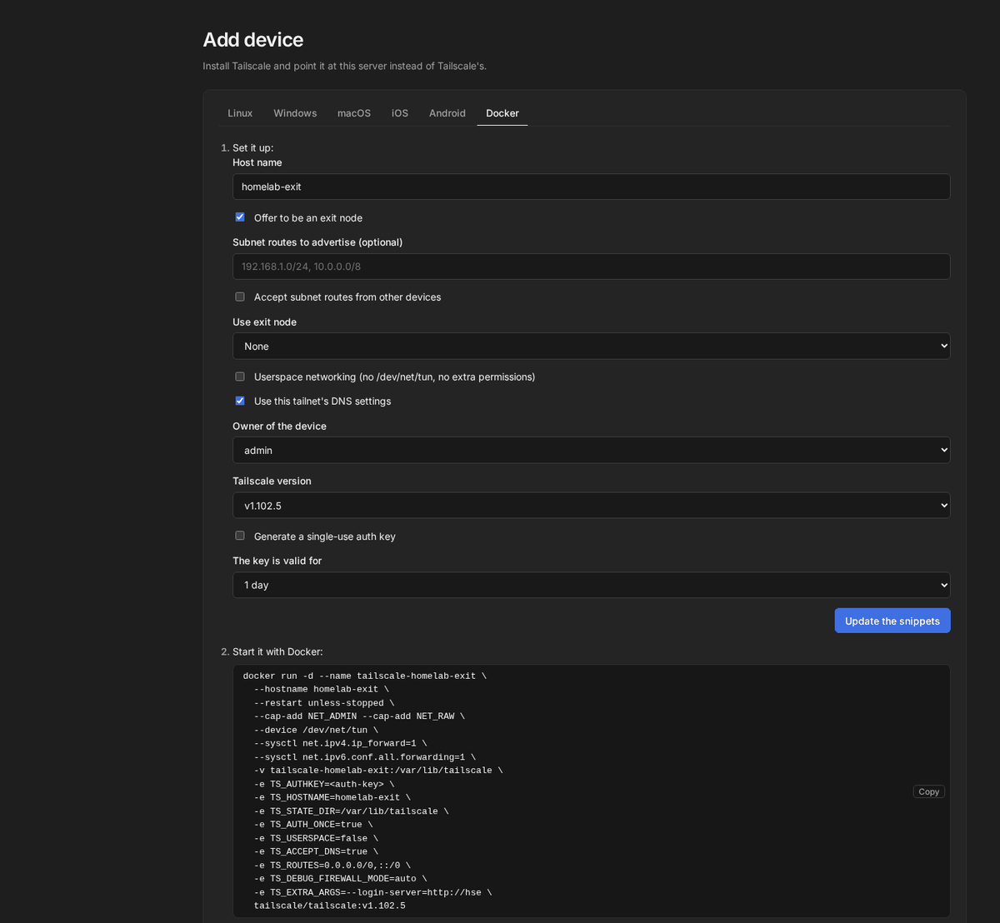
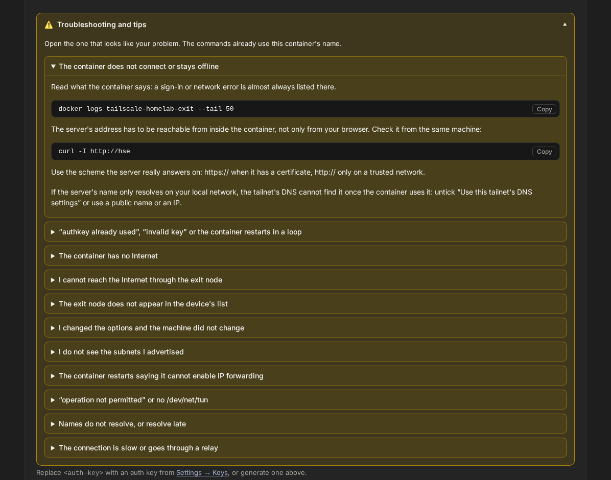
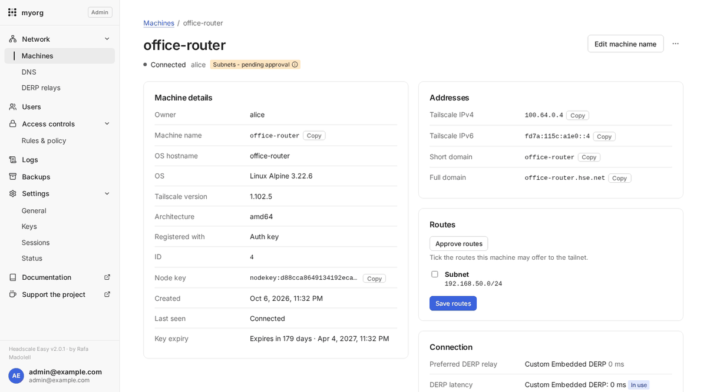

<p align="center">
  
</p>

<h1 align="center">Headscale Easy</h1>

<p align="center">
  <b>Headscale, with everything around it.</b><br>
  A deployment and management layer for <a href="https://github.com/juanfont/headscale">Headscale</a>, the open source Tailscale control server:
  HTTPS, accounts and sign-in, a Tailscale-style web console and backups. One Docker Compose file to install.
</p>

<p align="center">
  <a href="https://github.com/insanerask77/headscale-easy/actions/workflows/ci.yml"></a>
  <a href="https://github.com/insanerask77/headscale-easy/releases"></a>
  <a href="https://github.com/insanerask77/headscale-easy/pkgs/container/headscale-easy"></a>
  <a href="https://insanerask77.github.io/headscale-easy/"></a>
  <a href="LICENSE"></a>
  <a href="https://github.com/insanerask77/headscale-easy/stargazers"></a>
  <a href="https://ko-fi.com/rafaelmadolell"></a>
</p>

<p align="center">
  <b>English</b> · <a href="README.es.md">Español</a>
</p>

> [!IMPORTANT]
> **Headscale Easy 1.x is discontinued** as of 2.0.0 (6 October 2026): no more fixes, security fixes included.
> There is no in-place upgrade; install 2.0 as a new deployment. See
> [1.x is discontinued](https://insanerask77.github.io/headscale-easy/1x-end-of-life/).

> [!WARNING]
> **Security notice.** This is security-sensitive networking software, and a
> young project (September 2026) with one maintainer. AI-assisted development
> was used extensively and **there has been no independent security audit**.
> Review and harden your deployment before exposing it to the Internet — see
> [SECURITY.md](SECURITY.md), the [hardening guide](https://insanerask77.github.io/headscale-easy/hardening/) and
> [AI usage](AI_USAGE.md).

<p align="center">
  
</p>

---

## 🤔 Why Headscale Easy?

[Headscale](https://github.com/juanfont/headscale) works well on its own, and
Headscale Easy runs the **official, unmodified** Headscale binary — it is not a
fork or a replacement. What takes time is the glue around it when you want a
complete self-hosted setup for several people:

> auth + DNS + HTTPS + device management + backups = a weekend project

Headscale Easy packages that glue, in the spirit of
[wg-easy](https://github.com/wg-easy/wg-easy) for WireGuard:

- **One container** — Headscale, HTTPS and the console in a single image, set
  up from your browser; pull the new image to update.
- **A web console** for everyday tasks, modelled on Tailscale's admin panel,
  where members manage only their own devices.
- **Centralised configuration** — a few variables or the wizard, one domain.
- **Auth, DNS, HTTPS and backups** set up with secure defaults.
- **Everything self-hosted** — use the official Tailscale apps on every
  device; only the server is yours.

If you are happy running Headscale by hand, you do not need this project.
More in [Why Headscale Easy?](https://insanerask77.github.io/headscale-easy/why/), including the end-to-end workflow.

### Headscale Easy and Headplane

[Headplane](https://github.com/tale/headplane) is an established,
feature-complete web UI for an **existing** Headscale — a good choice if you
already run Headscale. Headscale Easy **installs and wires the whole stack**
(Headscale, HTTPS, local accounts with 2FA and invitations, backups) and
includes its own console. See the [detailed comparison](https://insanerask77.github.io/headscale-easy/why/#headscale-easy-and-headplane).

## ✨ Features

- 🖥️ **Tailscale-style web console** at `/admin`: machines, users, DNS, access
  controls, keys. Dark and light themes, works on phones.
- 👤 **Real user accounts** built in: passwords, optional **two-factor (TOTP)**,
  invitations, password-reset links and sign-up — or plug in your own OIDC
  provider (Authentik, Keycloak, Pocket ID, Google…).
- 🔒 **Every user gets their own private VPN**: members only see and reach their
  own devices (ACL `autogroup:self`); admins manage everything.
- 📱 **Machines**: status, addresses, OS and client version with update hints,
  rename, expire, remove, key expiry, tags, **subnet routes and exit nodes**,
  filters, search and CSV export.
- 🐳 **Docker tab in Add device**: generates the `docker run` and `docker-compose.yml`
  for a Tailscale container (exit node, subnet routes, userspace mode, a
  pinned Tailscale version), keeps the auth key in a separate `.env`, gives the
  command to apply a changed option to a running container, and has a
  troubleshooting dropdown with eleven common problems.
- ✅ **Routes waiting for approval** are flagged in the machine's badge, can be
  approved in one click, and administrators see a banner counting them.
- 🔑 **Auth keys** (one-off, reusable, ephemeral) and API keys; register
  devices by auth ID.
- 🌐 **DNS**: MagicDNS, tailnet domain, nameservers, split DNS, search domains —
  validated with `headscale configtest` and rolled back if Headscale refuses them.
- 📝 **Access controls**: visual editor for rules, groups and tag owners, a
  test-access simulator ("can ana reach nas:445?"), and the raw HuJSON editor
  as a full fallback.
- 🔐 **HTTPS your way**: Let's Encrypt, self-signed, behind your existing proxy
  (Nginx Proxy Manager, nginx, Traefik, Caddy — ready-made snippets), or plain
  HTTP on a LAN.
- 🌍 **English, Spanish, French, German and Portuguese** in the console (more welcome!).
- 💾 **Daily backups** of everything (database, keys, accounts, configuration)
  and a one-command restore, also on a new server.
- 🪶 **Lightweight**: one container, about 70 MB of RAM; the console is plain
  Python standard library, no build step, no JavaScript framework.

## 📸 Screenshots

| Machines (light) | Machine details |
|---|---|
|  |  |
| **Users** | **DNS** |
|  |  |
| **Access controls** | **Keys** |
|  |  |
| **Sign in** | **Add device** |
|  |  |
| **Add device, Docker tab** | **Docker troubleshooting and tips** |
|  |  |
| **Routes pending approval (light)** | **Machines (dark)** |
|  |  |

## 🚀 Quick start

You need a Linux host with Docker and the Compose plugin (v2.24 or newer) and, for
real HTTPS, a domain pointing at it.

```bash
mkdir headscale-easy && cd headscale-easy
curl -fsSLO https://raw.githubusercontent.com/insanerask77/headscale-easy/main/compose.yaml
docker compose up -d
```

That is the whole install: one container, version 2.0 pinned in `compose.yaml`.
Then:

1. **Open the setup wizard** at `http://<your-server>/admin/setup` and enter the
   one-time token (`docker compose logs`). Create the administrator, name the
   tailnet, set the public address and HTTPS (Let's Encrypt needs a domain and
   ports 80/443 open), choose the relay (DERP), sign-up mode and backups.
2. **Sign in** at `https://your-domain/admin`.
3. **Connect your first device** with the official Tailscale app.

Prefer to answer in advance? Copy [`.env.example`](.env.example) to `.env` (public
address, HTTPS, administrator) before `docker compose up -d`: every line is optional.
To update, change `HSE_VERSION` (or the tag in `compose.yaml`) and run
`docker compose pull && docker compose up -d`; your settings and data live in
volumes and are never touched.

```bash
tailscale up --login-server=https://your-domain
```

On phones and desktop apps, choose **"Use an alternate server"** / **"Change
server"** and enter the same URL. The console's **Add device** page shows the
exact steps for each OS.

**Before production**, go through the [production and hardening guide](https://insanerask77.github.io/headscale-easy/hardening/):
firewall, HTTPS, sign-in and two-factor, restricting the console, secrets,
off-site backups and updates.

### Ports

| Port | Protocol | Purpose |
|------|----------|---------|
| 80 / 443 | TCP | Web console, control plane, Let's Encrypt |
| 3478 | UDP | STUN for the embedded DERP relay (must be reachable) |

## ⚙️ Advanced configurations

The simple install above is enough for most people. When you need more, each option
is a small add-on to the same Compose app: an external PostgreSQL, your own identity
provider (Authentik, Pocket ID, Keycloak, Google), a proxy in front, remote backups.
See [Advanced configurations](https://insanerask77.github.io/headscale-easy/advanced/)
and [`advanced/`](advanced/).

Without Compose, the same image runs with `docker run -d --name headscale-easy -p 80:80
-p 443:443 -p 3478:3478/udp -v hse:/data ghcr.io/insanerask77/headscale-easy:2.0.0`; the
[all-in-one image](https://insanerask77.github.io/headscale-easy/all-in-one/) page lists
the variables for a headless start.

## 🧩 How it works

```
               ┌──────────────── headscale-easy (one container) ────────────────┐
:80/:443 ────▶ │ caddy ──┬─ /       ──▶ headscale (official binary, child proc)  │
:3478/udp ───▶ │         └─ /admin  ──▶ console (Python)                         │
               │ supervisor: starts and restarts the three, configtest, backups  │
               │ /data: headscale/ caddy/ console/ config/ backups/              │
               └─────────────────────────────────────────────────────────────────┘
       optional, outside: OIDC provider · PostgreSQL · front proxy · remote backup
```

Tailscale clients only talk to Headscale: the console is not in the data
path, and devices keep working if it is stopped. There is **no Docker socket**:
a small supervisor inside the container validates and restarts Headscale when
the console asks. Everything lives on one domain, and the container runs as an
unprivileged user with no added capability. Details in
[Architecture and resources](https://insanerask77.github.io/headscale-easy/architecture/).

### Resource usage

Measured by CI on a freshly built image (details and method in
[Architecture and resources](https://insanerask77.github.io/headscale-easy/architecture/)):

| | Measured | CI limit |
|---|---:|---:|
| Containers | **1** | — |
| Image size | **232 MB** | 250 MB |
| RAM, idle | **71 MB** | 100 MB |
| RAM, while a backup runs | **71 MB** | 100 MB |

Headscale alone idles at about 20 MB: Caddy, the console, the supervisor and the
backups add roughly 50 MB. An identity provider is optional and runs outside:
use the one you already have.

## 📚 Documentation

**📖 [insanerask77.github.io/headscale-easy](https://insanerask77.github.io/headscale-easy/)** — English and Spanish.

- [Getting started](https://insanerask77.github.io/headscale-easy/getting-started/) — requirements, install, first device.
- [Configuration](https://insanerask77.github.io/headscale-easy/configuration/) — HTTPS modes, sign-in and roles,
  DNS, database, and the environment-variable reference.
- [Operations](https://insanerask77.github.io/headscale-easy/operations/) — users and admins, machines, updates, backups,
  troubleshooting.
- [Production and hardening](https://insanerask77.github.io/headscale-easy/hardening/) — checklist, firewall, HTTPS,
  sign-in, restricting the console, secrets, backups, updates, logs.
- [Why Headscale Easy?](https://insanerask77.github.io/headscale-easy/why/) — the problem it solves, comparison with
  Headplane, end-to-end workflow.
- [Architecture and resources](https://insanerask77.github.io/headscale-easy/architecture/) — what each component does
  and what it costs.
- [Roadmap](ROADMAP.md) · [Contributing](CONTRIBUTING.md) · [Security](SECURITY.md) · [AI usage](AI_USAGE.md) · [Changelog](CHANGELOG.md)

## 🤖 AI usage

Headscale Easy was built with extensive help from
[Claude Code](https://claude.com/claude-code): it generated or modified a
significant part of the code, and helped with debugging, refactoring,
translations and documentation. The maintainer designed the project, reviewed,
tested and integrated every change, and is responsible for the code and the
final decisions. Commits it took part in carry a `Co-Authored-By: Claude`
trailer. Independent review is strongly recommended — see
[AI_USAGE.md](AI_USAGE.md).

## 🙌 Support the project

Headscale Easy is built and maintained in my spare time by
**[Rafa Madolell](https://github.com/insanerask77)**. If it saves you time or
money:

- ⭐ **Star the repo** — it really helps others find it.
- ☕ **[Buy me a coffee on Ko-fi](https://ko-fi.com/rafaelmadolell)**.
- 🐛 Report bugs, suggest features, or send a pull request.
- 🌍 Translate the console into your language (see [CONTRIBUTING](CONTRIBUTING.md#translations)).

<a href="https://ko-fi.com/rafaelmadolell"></a>

## 👥 Contributors

Thanks to everyone who has sent a fix or an improvement:

- [@vhryniv](https://github.com/vhryniv) — application user agent on outbound
  OIDC requests, so SSO works behind proxies that block Python's default one
  ([#21](https://github.com/insanerask77/headscale-easy/pull/21)).

## ⚖️ License and credits

[MIT](LICENSE) © 2026 [Rafa Madolell](https://github.com/insanerask77).

Built on the shoulders of [Headscale](https://github.com/juanfont/headscale),
and [Caddy](https://caddyserver.com).
Icons from [Lucide](https://lucide.dev), font [Inter](https://rsms.me/inter/) —
see [third-party notices](THIRD_PARTY_NOTICES.md).

Headscale Easy is an independent project, not affiliated with or endorsed by
Tailscale Inc. or the Headscale project. "Tailscale" is a trademark of
Tailscale Inc.
