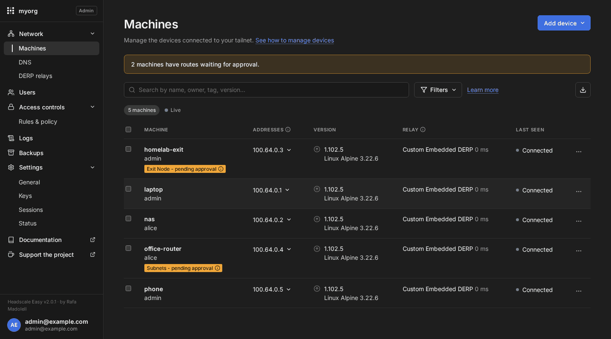
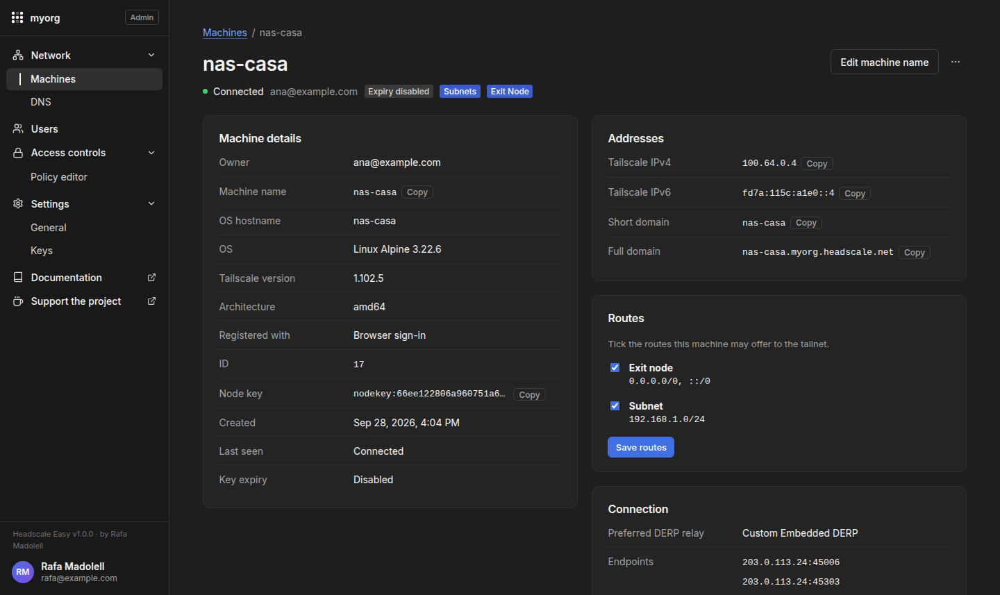
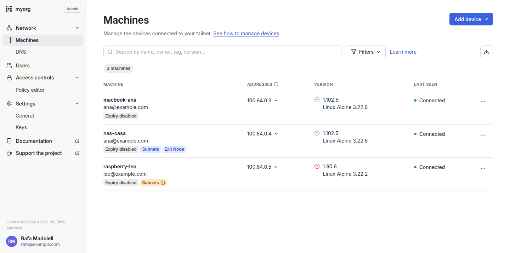
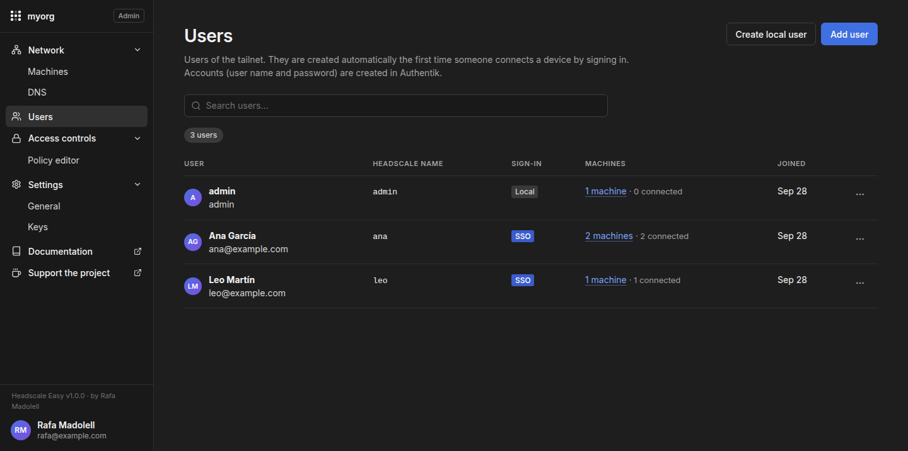
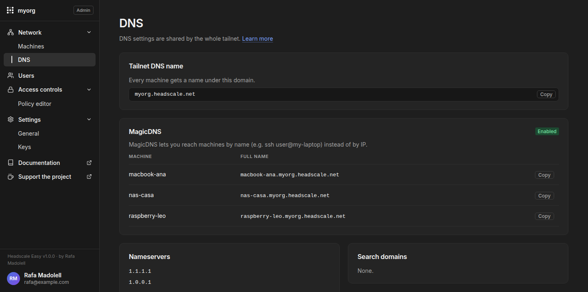
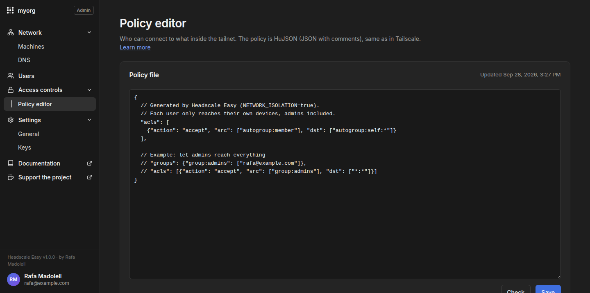
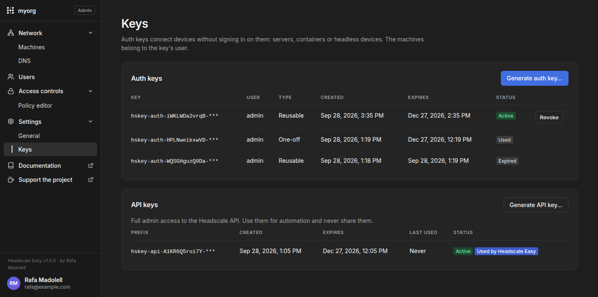
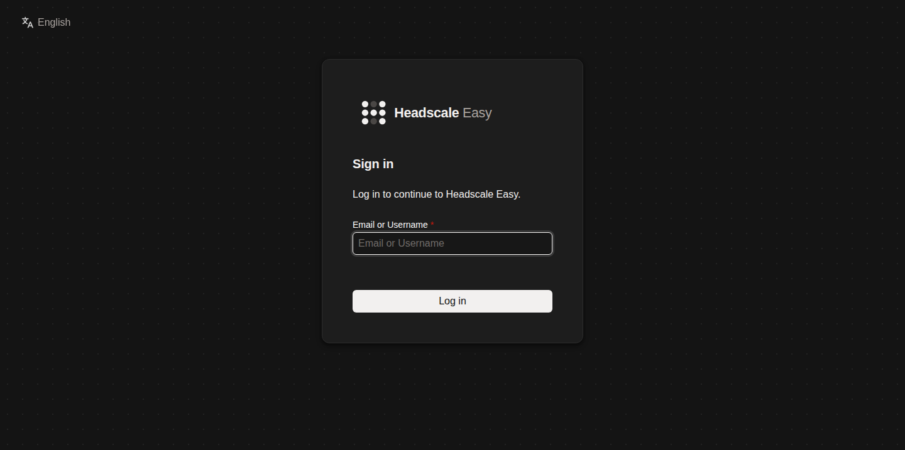

---
hide:
  - navigation
  - toc
---

{ width="72" }

# Headscale Easy

**Headscale, con todo lo que lo rodea.** 
Una capa de despliegue y gestión para Headscale: instalador, HTTPS, cuentas e
inicio de sesión, una consola web estilo Tailscale y copias de seguridad. Se
instala con un solo comando.

[Empezar](getting-started.md){ .md-button .md-button--primary }
[GitHub](https://github.com/insanerask77/headscale-easy){ .md-button }
[:simple-kofi: Invítame a un café en Ko-fi](https://ko-fi.com/rafaelmadolell){ .md-button }

{ .hse-shot }

!!! warning "Aviso de seguridad"
    Es software de red sensible en seguridad y un proyecto joven con un solo
    mantenedor. Se ha usado desarrollo asistido por IA de forma extensa
    ([uso de IA](ai-usage.md)) y **no ha pasado ninguna auditoría de seguridad
    independiente**. Revisa y bastiona tu despliegue antes de exponerlo a
    Internet: consulta [Seguridad](security.md) y
    [Producción y bastionado](hardening.md).

[Headscale](https://github.com/juanfont/headscale) funciona bien por sí solo;
lo que lleva tiempo es el pegamento alrededor: auth, DNS, HTTPS, gestión de
dispositivos y copias. **Headscale Easy** usa el Headscale oficial sin
modificar y empaqueta ese pegamento, como hace [wg-easy](https://github.com/wg-easy/wg-easy)
con WireGuard: instalado por un script
interactivo y gestionado desde una consola inspirada en el panel de Tailscale.
En los dispositivos usas las apps oficiales de Tailscale; sólo el servidor es tuyo.

## Funcionalidades

-   :material-monitor-dashboard: **Consola estilo Tailscale**

    Máquinas, usuarios, DNS, control de acceso y claves en `/admin`. Tema oscuro
    y claro, funciona en el móvil.

-   :material-account-lock: **Cuentas de usuario reales**

    Contraseñas con Authentik integrado, **login con Google** opcional o tu
    propio proveedor OIDC.

-   :material-shield-account: **Una VPN privada por usuario**

    Los miembros sólo ven y alcanzan sus dispositivos; los admins lo gestionan todo.

-   :material-router-network: **Rutas y exit nodes**

    Aprueba rutas de subred y exit nodes, edita etiquetas, expira claves,
    renombra, filtra y exporta máquinas.

-   :material-dns: **DNS y ACL**

    MagicDNS, nameservers, split DNS y la política HuJSON, validados antes de
    aplicarse.

-   :material-lock-check: **HTTPS a tu manera**

    Let's Encrypt, autofirmado, detrás de tu proxy (se genera la configuración)
    o HTTP en una LAN.

-   :material-translate: **Inglés, español, francés, alemán y portugués**

    En el instalador y en la consola. Se aceptan más idiomas.

-   :material-feather: **Ligero**

    La consola es Python de la librería estándar: sin compilación, sin framework
    JavaScript y sin base de datos propia.

## Capturas

=== "Detalle de máquina"
    { .hse-shot }
=== "Tema claro"
    { .hse-shot }
=== "Usuarios"
    { .hse-shot }
=== "DNS"
    { .hse-shot }
=== "Control de acceso"
    { .hse-shot }
=== "Claves"
    { .hse-shot }
=== "Inicio de sesión"
    { .hse-shot }

## Apoya el proyecto

Headscale Easy lo crea y mantiene en su tiempo libre
**[Rafa Madolell](https://github.com/insanerask77)**. Si te ahorra tiempo o dinero,
⭐ [dale una estrella al repositorio](https://github.com/insanerask77/headscale-easy) e
☕ [invítame a un café en Ko-fi](https://ko-fi.com/rafaelmadolell).

<small>Headscale Easy es un proyecto independiente, sin relación con Tailscale Inc.
ni con el proyecto Headscale. "Tailscale" es una marca de Tailscale Inc.</small>
